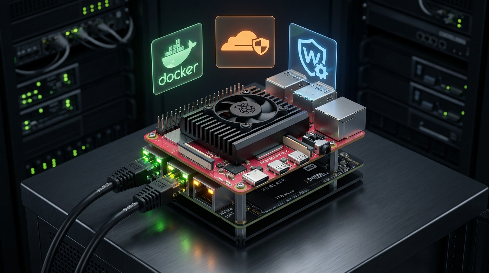

# 🍓 Raspberry Pi 5 Homelab & Micro-Server Infrastructure

[-C51A4A.svg)](https://raspberrypi.com/)
[](https://docker.com/)
[](https://cloudflare.com/)
[]()

> **Infraestrutura autônoma de servidores domésticos (Homelab)** orquestrada com Docker Compose sobre um Raspberry Pi 5 com boot e armazenamento em SSD NVMe de alta velocidade. O ambiente opera 13 microsserviços integrados cobrindo rede privada, segurança Zero Trust, banco de dados, mensageria e automação de processos.

> 🤖 **Nota de Transparência**: A documentação técnica, diagramas de rede e estruturação deste repositório foram gerados/organizados de forma automatizada com assistência de Inteligência Artificial (Google DeepMind Antigravity / Gemini), com base na arquitetura, configurações de Docker e infraestrutura física desenvolvida pelo autor.

---

## 📸 Arquitetura Física & Cluster Homelab

<p align="center">
  
  <br />
  <strong>Micro-Servidor Raspberry Pi 5 (8GB) com Armazenamento NVMe PCIe:</strong><br />
  <em>Orquestração de 13 microsserviços em containers Docker, segurança Zero Trust via Cloudflare Tunnels e túneis VPN WireGuard.</em>
</p>

---

## 🗺️ Mapa de Serviços & Arquitetura de Rede

```
                     INTERNET / REDE EXTERNA
                                │
               ┌────────────────┴────────────────┐
               ▼                                 ▼
      [Cloudflare Tunnel]              [WireGuard VPN Easy]
     (Acesso Zero Trust HTTPS)          (Acesso à Rede Local)
               │                                 │
  ═════════════╪═════════════════════════════════╪══════════════
               │        REDE INTERNA DOCKER     │
               ▼                                 ▼
    ┌──────────────────────┐           ┌──────────────────────┐
    │  Painéis de Controle │           │ Infraestrutura Core  │
    │  • Portainer (Docker)│           │  • AdGuard Home (DNS)│
    │  • Homarr Dashboard  │           │  • Uptime Kuma (Mon) │
    │  • Dashdot (Métricas)│           │  • Vaultwarden (Auth)│
    └──────────────────────┘           └──────────────────────┘
               │                                 │
               ▼                                 ▼
    ┌──────────────────────┐           ┌──────────────────────┐
    │  Ecossistema Dados   │           │    Comunicação       │
    │  • Postgres 16 Alpine│           │  • Evolution API     │
    │  • Redis 7.2 (Queue) │           │    (WhatsApp Gateway)│
    │  • Baserow (No-Code) │           │  • Syncthing (Sync)  │
    └──────────┬───────────┘           └──────────┬───────────┘
               │                                  │
               └────────────────┬─────────────────┘
                                ▼
                   ┌──────────────────────────┐
                   │    n8n Workflow Engine   │
                   │ (Master + Worker em Fila)│
                   └──────────────────────────┘
```

---

## 📦 Inventário de Serviços

| Categoria | Serviço | Imagem Docker | Propósito |
|---|---|---|---|
| **Segurança & Rede** | `cloudflared` | `cloudflare/cloudflared` | Túnel criptografado sem necessidade de abrir portas no roteador (CGNAT bypass) |
| **Segurança & Rede** | `wg-easy` | `ghcr.io/wg-easy/wg-easy` | Servidor VPN WireGuard com interface web para gestão de dispositivos |
| **Segurança & Rede** | `adguardhome` | `adguard/adguardhome` | Servidor DNS com bloqueio de rastreadores, anúncios e proteção contra malwares |
| **Monitoramento** | `uptime-kuma` | `louislam/uptime-kuma` | Monitor de disponibilidade 24/7 com alertas de queda de serviços |
| **Monitoramento** | `dashdot` | `mauricenino/dashdot` | Dashboard minimalista de telemetria de CPU, RAM, temperatura e rede do Pi |
| **Gestão** | `portainer` | `portainer/portainer-ce` | Interface visual completa de gerenciamento de contêineres e volumes |
| **Gestão** | `homarr` | `ghcr.io/ajnart/homarr` | Painel de controle inicial (*dashboard*) com atalhos de todos os serviços |
| **Produtividade** | `vaultwarden` | `vaultwarden/server` | Gerenciador de senhas pessoal auto-hospedado (compatível com Bitwarden) |
| **Produtividade** | `syncthing` | `linuxserver/syncthing` | Sincronização contínua e criptografada de pastas (Obsidian Vault) |
| **Produtividade** | `baserow` | `baserow/baserow:1.28.0` | Banco de dados no-code relacional para organização de tabelas operacionais |
| **Backend & Fila** | `postgres` | `postgres:16.4-alpine` | Banco relacional com verificações de saúde (*healthcheck*) |
| **Backend & Fila** | `redis` | `redis:7.2-alpine` | Cache em memória e fila distribuída BullMQ para o motor n8n |
| **Automação** | `n8n` & `n8n-worker` | `n8nio/n8n:2.4.8` | Orquestrador de tarefas rodando em modo de fila de alta concorrência (*queue mode*) |
| **Mensageria** | `evolution_api` | `evoapicloud/evolution-api` | Gateway de conexão com a API do WhatsApp para chatbots e notificações |

---

## 🛡️ Práticas de Segurança e Engenharia

1. **Zero Open Ports**: O acesso externo é 100% roteado via **Cloudflare Tunnels** com autenticação em duas etapas e regras de Firewall de borda, eliminando exposição de IPs públicos ou necessidade de DMZ no roteador residencial.
2. **Alta Performance em SSD**: Todo o diretório `/mnt/ssd/docker_data` é mapeado em um SSD NVMe dedicado de 256 GB, evitando a degradação e lentidão comuns de cartões MicroSD em bancos como PostgreSQL e Redis.
3. **Escalonamento em Fila**: O n8n opera com processo mestre e processo trabalhador (`n8n-worker`) segregados via Redis BullMQ, assegurando que automações pesadas não travem a interface web.

---

## 🚀 Como Iniciar

1. Clone o repositório no seu servidor ou Raspberry Pi:
   ```bash
   git clone https://github.com/enzo-grasciano-de-figueiredo/raspberry-pi-homelab-infrastructure.git
   cd raspberry-pi-homelab-infrastructure
   ```
2. Crie seu arquivo de variáveis de ambiente a partir do exemplo:
   ```bash
   cp .env.example .env
   # Preencha suas senhas fortes e tokens no arquivo .env
   ```
3. Inicialize a stack de serviços:
   ```bash
   docker compose up -d
   ```

---

## 👨‍💻 Autor

Desenvolvido por **Enzo Grasciano de Figueiredo**  
Universidade Federal do Paraná (UFPR)  
E-mail: enzo.g.figueiredo@gmail.com  
GitHub: [@enzo-grasciano-de-figueiredo](https://github.com/enzo-grasciano-de-figueiredo)
